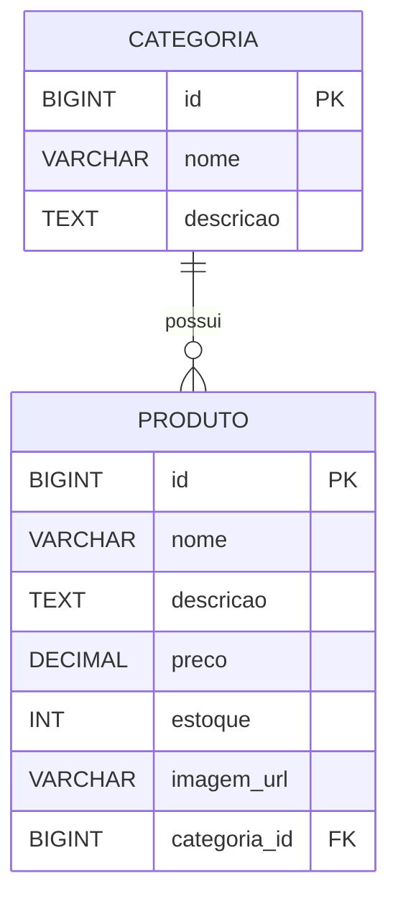

# 🎮 Eternal Games

Bem-vindo à **Eternal Games** — uma loja de jogos fictícia desenvolvida em **Java com Spring Boot**.  
O projeto está **em fase de desenvolvimento**, e novas funcionalidades estão sendo adicionadas gradualmente.

---

## 🏗️ Sobre o Projeto

A **Eternal Games** é uma loja virtual de jogos digitais criada com fins **educacionais e demonstrativos**.  
O sistema simula o funcionamento de um e-commerce básico, incluindo:

- Cadastro e listagem de produtos (jogos);
- Organização por categorias;
- Exibição de detalhes de cada produto;
- Sistema de busca e filtragem;
- Integração com banco de dados relacional.

> ⚠️ **Atenção:** Este é um projeto **fictício**, criado apenas para fins de aprendizado.  
> Nenhum produto, dado ou transação é real.

---

## 🧩 Modelagem de Dados

A aplicação segue uma arquitetura **relacional**, com as principais entidades sendo **Produto** e **Categoria**.

### 🗂️ Tabelas Principais

#### **Tabela: categoria**
| Campo         | Tipo        | Descrição                       |
|----------------|--------------|----------------------------------|
| id             | BIGINT (PK)  | Identificador único da categoria |
| nome           | VARCHAR(100) | Nome da categoria (ex: Ação)     |
| descricao      | TEXT         | Descrição da categoria           |

#### **Tabela: produto**
| Campo         | Tipo         | Descrição                              |
|----------------|---------------|----------------------------------------|
| id             | BIGINT (PK)   | Identificador único do produto         |
| nome           | VARCHAR(150)  | Nome do jogo                           |
| descricao      | TEXT          | Descrição detalhada do jogo            |
| preco          | DECIMAL(10,2) | Preço do produto                       |
| estoque        | INT           | Quantidade disponível em estoque       |
| imagem_url     | VARCHAR(255)  | URL da imagem ilustrativa              |
| categoria_id   | BIGINT (FK)   | Referência à categoria do produto      |

---

### 🔗 Relacionamento entre Tabelas

| Entidade Principal | Relacionamento | Entidade Secundária | Tipo de Relação |
|--------------------|----------------|---------------------|-----------------|
| **Categoria**      | 1 → N          | **Produto**         | Uma categoria pode ter vários produtos |
| **Produto**        | N → 1          | **Categoria**       | Um produto pertence a uma única categoria |

---

### 🧠 Diagrama ER (Mermaid)



---

## 🛠️ Tecnologias Utilizadas

| Categoria | Tecnologias |
|------------|--------------|
| **Linguagem** | Java 17+ |
| **Framework** | Spring Boot 3.x |
| **Banco de Dados** | MySQL / PostgreSQL |
| **ORM** | Spring Data JPA / Hibernate |
| **Gerenciador de Dependências** | Maven |
| **Testes** | JUnit |
| **Utilitários** | Lombok, SpringDoc OpenAPI (Swagger UI) |
| **IDE Recomendadas** | IntelliJ IDEA / Eclipse / VS Code |
| **Controle de Versão** | Git & GitHub |

---

## 🚀 Instruções de Instalação e Execução

### 1️⃣ Pré-requisitos

Certifique-se de ter instalado:
- **Java 17** ou superior  
- **Maven 3.9+**  
- **MySQL** ou **PostgreSQL** configurado  
- **Git**

---

### 2️⃣ Clonar o repositório
```bash
git clone https://github.com/seuusuario/eternal-games.git
```

### 3️⃣ Entrar na pasta do projeto
```bash
cd eternal-games
```

### 4️⃣ Configurar o banco de dados

No arquivo `application.properties` (ou `application.yml`), atualize suas credenciais:

```properties
spring.datasource.url=jdbc:mysql://localhost:3306/eternalgames
spring.datasource.username=seu_usuario
spring.datasource.password=sua_senha
spring.jpa.hibernate.ddl-auto=update
spring.jpa.show-sql=true
spring.jpa.properties.hibernate.dialect=org.hibernate.dialect.MySQL8Dialect
```

---

## 📅 Status do Projeto
🚧 **Em desenvolvimento**

Funcionalidades atuais e planejadas:
- [x] Estrutura inicial do projeto Spring Boot  
- [x] Entidades `Produto` e `Categoria`  
- [x] Repositórios JPA  
- [ ] Interface Frontend (React ou Thymeleaf)  
- [ ] Sistema de autenticação (Spring Security)  
- [ ] Carrinho de compras  

---

## 🤝 Contribuição

Sinta-se à vontade para contribuir!  
1. Faça um **fork** do repositório  
2. Crie uma **branch** para sua modificação  
3. Envie um **pull request**

---

## 📜 Licença

Este projeto é apenas para **fins educacionais** e **não possui fins comerciais**.  
Distribuído sob a licença **MIT**.

---

**Eternal Games** — onde cada jogo é uma nova aventura. 🕹️
